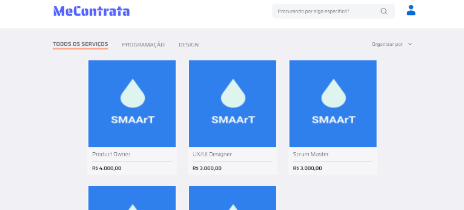

# Guia para desenvolvimento de testes Front-end web

## Sumário
1. [Introdução ao Guia](#1-introdução-ao-guia)
2. [Tipos de Testes](#2-tipos-de-testes)
   - [Testes Unitários](#21-testes-unitários)
   - [Testes de Integração](#22-testes-de-integração)
   - [Testes Funcionais](#23-testes-funcionais)
   - [Testes de Interface do Usuário](#24-testes-de-interface-do-usuário-ui)
   - [Testes de Performance](#25-testes-de-performance)
   - [Testes de Segurança](#26-testes-de-segurança)

3. [Configuração do Ambiente de Testes](#3-configuração-do-ambiente-de-testes)
	- [Aplicação Alvo](#31-aplicação-alvo)
	- [Ferramentas para Teste](#32-ferramentas-para-teste)
	- [Configurar ambiente](#33-configurar-ambiente)

4. [Boas Práticas em Testes](#4-boas-práticas-em-testes)
5. [Exemplos de Testes](#5-exemplos-de-testes)
   - [Testes Unitários](#51-testes-unitários)
   - [Testes de Integração](#52-testes-de-integração)
   - [Testes E2E](#53-testes-e2e)

## 1. Introdução ao Guia

Este guia tem como objetivo ajudar desenvolvedores front-end a realizar testes eficazes em suas aplicações web. Ele oferece uma introdução abrangente aos conceitos fundamentais de testes de software, proporcionando uma base sólida para a implementação de práticas de teste de qualidade.

Aqui, abordaremos desde os princípios básicos de testes até técnicas mais avançadas, cobrindo os diferentes tipos de testes que podem ser aplicados a projetos front-end. Além disso, discutiremos as melhores práticas para garantir que seus testes sejam eficazes, confiáveis e fáceis de manter.

Ao longo deste guia, você encontrará informações sobre:

- **Fundamentos dos Testes:** Compreenda a importância dos testes no ciclo de desenvolvimento e como eles contribuem para a qualidade e robustez do seu código.
- **Tipos de Testes:** Explore os diferentes tipos de testes, incluindo testes unitários, de integração, funcionais e de interface do usuário, e aprenda como e quando aplicar cada um.
- **Configuração do Ambiente de Testes:** Descubra como configurar seu ambiente de desenvolvimento para suportar testes automatizados e manuais.
- **Boas Práticas em Testes:** Conheça as melhores práticas para escrever, organizar e manter testes eficazes.
- **Exemplos Práticos:** Veja exemplos de testes para ilustrar como aplicar os conceitos discutidos em cenários reais.
- **Depuração e Manutenção:** Aprenda técnicas para depurar testes falhos e manter seus testes atualizados conforme seu projeto evolui.
- **Recursos Adicionais:** Encontre links para documentação, tutoriais e comunidades para expandir seu conhecimento e obter suporte adicional.

Este guia é projetado tanto para desenvolvedores iniciantes quanto para aqueles que desejam aprimorar suas habilidades em testes. Ao final, esperamos que você se sinta mais confiante na criação e execução de testes que garantam a qualidade e a robustez de suas aplicações front-end.


## 2. Tipos de Testes

Nesta seção, abordaremos os principais tipos de testes utilizados no desenvolvimento de front-end web, essenciais para garantir a qualidade e a confiabilidade da aplicação.

### 2.1 Testes Unitários
 
Testes unitários são projetados para verificar a funcionalidade de pequenas unidades de código, como funções ou métodos, de forma isolada. O objetivo é garantir que cada unidade opere conforme o esperado, sem dependências externas. Esses testes ajudam a identificar rapidamente problemas em partes específicas do código e facilitam a manutenção do software.

### 2.2 Testes de Integração
 
Testes de integração avaliam a interação entre diferentes módulos ou componentes da aplicação. Eles garantem que as partes do sistema funcionem bem juntas e que as interfaces entre esses módulos estejam corretas. Esses testes são essenciais para verificar se os dados fluem adequadamente entre componentes e se a aplicação como um todo se comporta de acordo com os requisitos.

### 2.3 Testes Funcionais
 
Testes funcionais focam em verificar se as funcionalidades da aplicação atendem aos requisitos especificados. Eles testam a aplicação do ponto de vista do usuário final, garantindo que os fluxos de trabalho e as funcionalidades sejam executados adequadamente. Esses testes são importantes para validar que a aplicação realiza as tarefas que os usuários esperam.

### 2.4 Testes de Interface do Usuário
 
Testes de User Interface (UI) verificam se os elementos visuais da aplicação são exibidos adequadamente e se as interações do usuário funcionam como esperado. Eles asseguram que a interface seja amigável e intuitiva, e que os elementos gráficos estejam corretos e bem posicionados. Esses testes ajudam a garantir uma boa experiência de usuário.

### 2.5 Testes de Performance
 
Testes de performance avaliam o desempenho da aplicação sob várias condições de carga. Eles medem aspectos como tempos de resposta, capacidade de processamento e uso de recursos para garantir que a aplicação funcione de maneira eficiente e escalável. Esses testes ajudam a identificar gargalos e a otimizar a performance da aplicação.

### 2.6 Testes de Segurança
 
Testes de segurança têm como objetivo identificar vulnerabilidades e fraquezas na aplicação que poderiam ser exploradas por atacantes. Eles verificam aspectos como autenticação, autorização e proteção contra ataques comuns (como XSS e SQL Injection). Garantir a segurança da aplicação é crucial para proteger dados sensíveis e garantir a integridade e a confidencialidade das informações.

## 3. Configuração do Ambiente de Testes

### 3.1 Aplicação Alvo



Para a elaboração dos testes, foi criada uma aplicação específica que servirá como ambiente de estudo. Esta aplicação foi projetada com o objetivo principal de demonstrar de maneira prática como os testes podem ser elaborados e aplicados no contexto do desenvolvimento front-end web. Ao proporcionar exemplos concretos de implementação de testes, pretende-se facilitar a compreensão dos leitores, permitindo-lhes visualizar diretamente como essas técnicas podem ser aplicadas em situações reais de desenvolvimento de software.

A aplicação em questão é desenvolvida utilizando o framework Next.js e se comunica com uma API REST. Para fins de demonstração e aprendizado, vamos utilizar o fluxo de listagem de busca como nosso laboratório de testes. Esse fluxo será o foco principal para apresentar exemplos práticos e boas práticas de testes em desenvolvimento web.

## 3.2 Ferramentas para Teste

A realização de testes eficazes em uma aplicação web é crucial para garantir que ela funcione adequadamente e ofereça uma experiência de usuário de alta qualidade. Para facilitar a criação e execução de testes, existem diversas ferramentas disponíveis que ajudam a automatizar e gerenciar esse processo. Neste guia, abordaremos duas das ferramentas mais populares no desenvolvimento front-end: Jest e Cypress.

### Jest

Jest é uma ferramenta de teste de JavaScript, amplamente utilizada para testar aplicações Node.js. É um framework de testes unitários e de integração que se destaca pela sua simplicidade e facilidade de configuração. Jest oferece uma série de funcionalidades, incluindo:

- **Testes Unitários e de Integração:** Permite escrever testes para verificar a funcionalidade de unidades de código e a interação entre diferentes partes da aplicação.
- **Mocks e Spies:** Facilita a criação de mocks e spies para simular e monitorar o comportamento de dependências e funções.
- **Cobertura de Código:** Fornece relatórios detalhados sobre a cobertura de código, ajudando a identificar áreas não testadas.
- **Execução Paralela de Testes:** Melhora a eficiência ao executar testes em paralelo, reduzindo o tempo total de execução.

**Exemplo de Uso:**  
Para testar uma função de utilitário que calcula descontos, você pode usar Jest para garantir que a função retorna os valores esperados para diferentes entradas.

```javascript
// Função gerar o preço real
function fitPrice(price) {
    return (preco / 100);
}

// Teste unitário com Jest
import { aplicarDesconto } from './utils';

test('should call fitPrice and return real price', () => {
    expect(fitPrice(100)).toBe(1);
});
```

### Cypress

Cypress é uma ferramenta de teste end-to-end projetada para a automação de testes de interface do usuário em aplicações web. É conhecida por sua simplicidade de configuração e pela integração poderosa com o navegador, o que permite realizar testes funcionais e de integração de forma eficaz. Algumas das características principais do Cypress incluem:

- **Testes End-to-End:** Permite simular interações reais do usuário e verificar o comportamento da aplicação em um navegador real, garantindo que a aplicação funcione conforme o esperado em situações de uso real.
- **Debugging Avançado:** Oferece uma interface de usuário interativa que facilita a depuração, permitindo visualizar o estado da aplicação em cada etapa do teste.
- **Snapshots e Vídeos:** Captura screenshots e grava vídeos dos testes em execução, o que ajuda na análise de falhas e na compreensão do comportamento da aplicação durante os testes.
- **Execução Rápida:** Executa testes de forma eficiente utilizando uma arquitetura que se comunica diretamente com o navegador, reduzindo o tempo total de execução dos testes.

**Exemplo de Uso:**  
Para testar uma página de login, você pode usar Cypress para simular o preenchimento do formulário e verificar se a mensagem de sucesso é exibida após a submissão.

```javascript
// Teste de login com Cypress
describe('Login Page', () => {
	it('should display success message when submitting the form', () => {
		// Acessar tela de Login
		cy.visit('/login');
		
		// Preencher campo de usuário
		cy.get('input[name="username"]').type('user');
		
		// Preencher campo de senha
		cy.get('input[name="password"]').type('password');
		
		// Acionar botão de login
		cy.get('button[type="submit"]').click();
		
		// Validar se o login foi efetuado com sucesso
		cy.contains('Login successful!').should('be.visible');
	});
});
```

### 3.3 Configurar ambiente

Neste tópico serão abordadas as configurações das ferramentas com foco no ambiente Linux; entretanto, os comandos também funcionam no CMD do Windows.

### Configuração do Jest

Sempre é recomendado seguir as orientações fornecidas na documentação oficial para garantir que sua configuração esteja correta e aproveitar ao máximo as funcionalidades da ferramenta. Para obter detalhes completos sobre a configuração e os recursos do Jest, consulte a [documentação oficial do Jest](https://jestjs.io/pt-BR/docs/getting-started).

#### Passos para Configuração

1. **Instale o Pacote Jest**

   Primeiro, adicione o Jest como uma dependência de desenvolvimento no seu projeto. Execute o seguinte comando no terminal:

   ```bash
   npm install --save-dev jest
   ```

2. **Gere o Arquivo de Configuração**

	Após instalar o Jest, você precisa gerar o arquivo de configuração. Execute o comando abaixo para inicializar a configuração padrão do Jest:

	```bash
	npx jest --init
	```

	Este comando criará um arquivo de configuração básico chamado `jest.config.js` (ou `jest.config.ts	`, se você estiver usando TypeScript). O arquivo de configuração permitirá que você personalize as opções de teste conforme necessário para seu projeto.

3. **Configure o Arquivo de Configuração**

	Após gerar o arquivo de configuração `jest.config.*`, você precisa ajustá-lo para garantir que os arquivos de teste sejam reconhecidos corretamente. 

	1. Abra o arquivo `jest.config.*` no seu editor de código.
	2. Localize a propriedade `testMatch` no arquivo de configuração.
	3. Atualize a configuração `testMatch` para incluir os seguintes padrões:

	```javascript
	testMatch: [
		"**/__tests__/**/*.[jt]s?(x)",
		"**/?(*.)+(spec|test).[tj]s?(x)"
	]
	```

	A configuração testMatch define quais arquivos devem ser considerados como arquivos de teste pelo Jest. Com essa configuração, o Jest buscará arquivos que correspondam aos padrões .spec.ts e .test.ts dentro dos diretórios __tests__ e em outros locais do projeto. Isso permite que você crie arquivos de teste com a extensão .spec.ts e o Jest os reconhecerá automaticamente durante a execução dos testes.

4. **Adicione um Script ao `package.json`**

	Para facilitar a execução dos testes, você pode adicionar um script ao seu arquivo `package.json`. Isso permite que você execute os testes com um comando simples. 

	1. Abra o arquivo `package.json` no seu projeto.
	2. Na seção `"scripts"`, adicione o seguinte script:

	```json
	{
		"scripts": {
			...
			"test": "jest",
			...
		}
	}
	```

### Cypress

Para garantir que você configure o Cypress corretamente e aproveite ao máximo suas funcionalidades, é altamente recomendável seguir as diretrizes e práticas recomendadas descritas na documentação oficial.

Para obter instruções detalhadas sobre como configurar o Cypress e entender seus recursos, consulte a [documentação oficial do Cypress](https://docs.cypress.io/guides/overview/why-cypress).

### Configuração do Cypress

1. **Instalação do Cypress**

   Para começar a usar o Cypress, você precisa instalá-lo como uma dependência de desenvolvimento em seu projeto. Abra seu terminal e execute o seguinte comando:

   ```bash
   npm install cypress --save-dev
   ```

2. **Inicialização do Cypress**

	Após a instalação, você pode inicializar o Cypress para configurar a estrutura de pastas padrão e adicionar arquivos de configuração. Execute o seguinte comando:

	```bash
	npx cypress open
	```

	Esse comando abrirá a interface gráfica do Cypress e criará automaticamente as pastas e arquivos necessários (cypress/ e cypress.json).

3. **Estrutura de Pastas**

	Após a inicialização, você verá uma estrutura de pastas semelhante a esta:

	```
	cypress/
	├── fixtures/
	├── integration/
	├── plugins/
	└── support/
	cypress.json
	```

	- `fixtures/`: Arquivos de dados para uso em testes.
	- `integration/`: Onde você escreve e armazena seus arquivos de teste.
	- `plugins/`: Scripts para customização do comportamento do Cypress.
	- `support/`: Arquivos e comandos auxiliares usados em seus testes.
	- `cypress.json`: Arquivo de configuração do Cypress.

4. **Configuração Básica**

	O arquivo cypress.json é usado para configurar as opções globais do Cypress. Você pode definir a URL base da sua aplicação para facilitar a escrita dos testes. Exemplo de configuração:

	```json
	{
		"baseUrl": "http://localhost:3000",
		"viewportWidth": 1280,
		"viewportHeight": 720
	}
	```

5. **Executando os Testes**

	Você pode executar os testes do Cypress usando a interface gráfica, que você abriu com o comando `npx cypress open`, ou executar os testes no terminal:

	```bash
	npx cypress run
	```

## 4. Boas Práticas em Testes

1. **Escreva testes pequenos e focados**
Os testes devem abranger pequenas unidades de código, como funções e componentes, de forma isolada. Isso facilita a identificação de falhas, tornando a depuração mais eficiente e simplificando a manutenção dos testes. A independência dos testes também ajuda a detectar problemas rapidamente em futuras atualizações ou refatorações.

2. **Siga a pirâmide de testes**
Utilize a pirâmide de testes como referência, priorizando os testes unitários, seguidos pelos testes de integração e, por último, os testes end-to-end. Essa estratégia assegura uma cobertura eficiente com menor custo de manutenção.

3. **Evite dependências externas**
Sempre evitar trabalhar com dependências externa em seus teste, utlize de *mocks* para simular esstas dependências e trate sempre como seu funcionamento esperado. 

4. **Teste o que importa**
Teste o comportamento do sistema, e não as implementações internas. Se um componente ou função for refatorado sem mudar sua funcionalidade, os testes não devem falhar. Isso garante que os testes validem o resultado final, não os detalhes de como ele é alcançado.

5. **Escreva testes legíveis**
Os testes devem ser fáceis de entender por outras pessoas, assim como o código principal deve seguir as práticas de *clean code*. Testes também são código e, portanto, precisam aderir a boas práticas de legibilidade e organização. É importante lembrar que a manutenção de um sistema inclui tanto o código da aplicação quanto seus testes, garantindo que ambos sejam claros e fáceis de manter ao longo do tempo.

6. **Garanta cobertura de código adequada**
Embora a cobertura de 100% não seja sempre o objetivo, é importante garantir que os cenários críticos e as funcionalidades principais sejam testados.

7. **Mantenha os testes atualizados**
Sempre que o código for atualizado, os testes também devem ser revisados. Manter testes obsoletos ou irrelevantes pode comprometer a qualidade geral do sistema. Certifique-se de que os testes acompanhem as mudanças no código, garantindo sua relevância e eficácia na detecção de possíveis falhas.

## 5. Exemplos de Testes

Neste topico será abordado testes na aplicação front-end.

### 5.1 Testes Unitários

Para iniciar os testes unitários, é necessário definir o que é uma unidade em seu projeto. Considerando que nossa aplicação alvo é um front-end em Next.js, podemos definir como unidades as funções utilitárias, que geralmente são utilizadas para manipular dados na aplicação, além dos hooks e contexts.

Em nossa aplicação alvo, o Me Contrata, temos as seguintes funções utilitarias no modulo de listagem de serviços.

```typescript
import { FilterType } from "@/types/filter-types";
import { PriorityTypes } from "@/types/priority-types";

export function getCategoryByType(type: FilterType) {

  switch (type) {
    case FilterType.PROGRAMMING:
      return 'PROGRAMMING';
    case FilterType.DESIGN:
      return 'DESIGN';
    default:
      return "";
  }
}

export function getFieldByPriority(priority: PriorityTypes) {

  switch (priority) {

    case PriorityTypes.NEWS:
      return { field: "created_at", order: "ASC" };
    case PriorityTypes.BIGGEST_PRICE:
      return { field: "price", order: "DESC" };
    case PriorityTypes.MINOR_PRICE:
      return { field: "price", order: "ASC" };
    default:
      return { field: "created_at", order: "ASC" };
  }
}

export function mountQuery(type: FilterType, priority: PriorityTypes) {

  const category = getCategoryByType(type);
  const field = getFieldByPriority(priority);

  return `?category=${category}&orderBy=${field.field}&order=${field.order}`;
};
```

Em geral, temos funções responsáveis pelo tratamento de Query Params de uma requisição, que envolvem várias condições e manipulação de strings. Por serem funções simples, sem a necessidade de renderizar conteúdos HTML da aplicação, o uso do Jest para implementar os testes é uma boa solução.

Para manter o projeto organizado, é recomendado criar um pasta 'specs' no dirétoruio de utilitarios, e como foi configurado no jest, ele irá monitorar esses arquivos.

Para função `getCategoryByType`, pode-se ver que temos uma condicional `switch`, o que implica ter casos de texte para cada `case` no codigo. Entretando no Jest podemos utilizar de funções especificas para não haver a necessida de criar varios testes que fazem a mesma preparação para os casos de teste.

```typescript
describe('getCategoryByType', () => {

	it.each([
		{ title: 'ALL', input: FilterType.ALL, expected: '' },
		{ title: 'PROGRAMMING', input: FilterType.PROGRAMMING, expected: 'PROGRAMMING' },
		{ title: 'DESIGN', input: FilterType.DESIGN, expected: 'DESIGN' },
	])('returns the correct category for $title filter type', ({ input, expected }) => {

		const result = getCategoryByType(input);
		expect(result).toEqual(expected);
	});
});
```

Para começar os teste no Jest aplicamos o `describe`, onde iremos definir a unidade a ser testado, no nosso caso, o `getCategoryByType`, uma das funções utilitaria da aplicação, onde é responsavel por preparar uma parte da *query* para consultar os serviços ofertados pela plataforma.

Como pode ser visto na função, temos vários pontos com fluxos condicionais, e para cada um desses pontos será necessário um caso de teste para cobrir completamente a função. Porém, por se tratar de uma função simples, não será necessário definir várias implementações de casos de teste, pois o código seria semelhante, com diferenças apenas nas entradas e saídas dos testes. 

Dado isso, o Jest disponibiliza o método `each`, que, simplificadamente, pode ser visto como uma estrutura de laço, onde são definidos parâmetros que serão passados para a `callback` dos testes em cada iteração especificada. Tendo em vista nossa função `getCategoryByType` precisariamos realizar três casos, dois para cada `case` do `switch` e um para o `default`.

Por se tratar de uma função simples, o teste pode ser escrito de forma concisa, utilizando o método `expect` em conjunto com `toEqual`. Dessa forma, definimos que "esperamos que o resultado da função seja igual a um valor esperado" para aquele caso de teste.

Para as demais funções desse mesmo arquivo, seguimos uma abordagem semelhante, sempre definindo testes simples, mas que possam cobrir de forma eficaz as funções utilitárias.

```typescript

describe('getFieldByPriority', () => {

	it.each([
		{ title: 'BIGGEST_PRICE', input: PriorityTypes.BIGGEST_PRICE, expected: { field: "price", order: "DESC" } },
		{ title: 'MINOR_PRICE', input: PriorityTypes.MINOR_PRICE, expected: { field: "price", order: "ASC" } },
		{ title: 'NEWS', input: PriorityTypes.NEWS, expected: { field: "created_at", order: "ASC" } },
		{ title: 'DEFAULT', input: 'DEFAULT', expected: { field: "created_at", order: "ASC" } },
	])('returns the correct category for $title filter type', ({ input, expected }) => {

		const result = getFieldByPriority(input as PriorityTypes);
		expect(result).toEqual(expected);
	});
});

describe('mountQuery', () => {

	it('returns the correct category for $title filter type', () => {

		const typeInput = FilterType.PROGRAMMING;
		const priorityInput = PriorityTypes.BIGGEST_PRICE;
		const result = mountQuery(typeInput, priorityInput);
		const expected = '?category=PROGRAMMING&orderBy=price&order=DESC';

		expect(result).toEqual(expected);
	});
});

```

### 5.2 Testes de Integração

Dado o seguinte componente do sistema, iremos construir seus teste Utilizando a biblioteca do Jest.

```Typescript

import styles from "./styles.module.css";
import { formatPrice } from "@/utils/format-price";

interface ProductCardProps {
	image: string;
	title: string;
	price: number;
}

export function ProductCard(props: ProductCardProps) {  

	const price = formatPrice(props.price);

	return (
		<div className={styles.card}>
			
			<div>
				<h3>{props.title}</h3>
				<div></div>
				<p>{price}</p>
			</div>
		</div>
	);
}

```

Esse teste foi desenvolvido para garantir que o componente `ProductCard` renderize corretamente os detalhes do produto. Por se tratar de um componente e ser mais complexo do que uma função utilitária, detalharemos os principais passos envolvidos na criação deste teste:

Primeiramente uremos usar as seguinte dependências para realizar os testes:

```Typescript

import { render, screen } from '@testing-library/react';
import { formatPrice } from '@/utils/format-price';
import { ProductCard } from '../index';

```

Aqui, você está importando funções e componentes necessários para o teste:

* `render` e `screen` do @testing-library/react são usados para renderizar o componente e acessar elementos no DOM renderizado.
* `formatPrice` é a função utilitária que formata o preço.
* `ProductCard` é o componente que você está testando.

Por termos uma dependência interna para o `formatPrice`, iremos definir um mock para que não afete nosso teste, utilizando o metodo `jest.mock` teremos  a essa definição.

```Typescript

jest.mock('../../../utils/format-price', () => ({
  formatPrice: jest.fn((price) => `$${price.toFixed(2)}`),
}));

```

Dado que estamos trabalhando com um componente HTML, precisamos renderizar seus elementos, para isso iremos usar o metodo `render` que irá "renderiazar" nosso componente, contruindo uma DOM virtual.

```Typescript

render(<ProductCard {...props} />);

```

**Dado que já temos uma "renderização" do componente, o que iremos validar com nossos testes?**

Iremos verificar se temos os elementos foram construidos no componente de forma correta. Para isso, iremos buscar os elementos do componente por meio de seus texto esperados e tags HTML utilizadas.

```Typescript

const image = screen.getByRole('img');
const title = screen.getByText(props.title);
const price = screen.getByText(formatPrice(props.price));

```

Por fim, dado os elementos buscado é aplicar metodos do Jest para validar suas integridades.

```Typescript

expect(image).toHaveProperty('src', props.image);
expect(title).not.toBeNull();
expect(price).not.toBeNull();

```

Código completo do teste:

```Typescript

import { render, screen } from '@testing-library/react';
import { formatPrice } from '@/utils/format-price';
import { ProductCard } from '../index';

jest.mock('../../../utils/format-price', () => ({
    formatPrice: jest.fn((price) => `$${price.toFixed(2)}`),
}));

describe('ProductCardProps', () => {

    it('should render product details correctly', () => {

        const props = {
            image: 'https://example.com/image.jpg',
            title: 'Test Product',
            price: 19.99,
        };

        render(<ProductCard {...props} />);

        const image = screen.getByRole('img');
        const title = screen.getByText(props.title);
        const price = screen.getByText(formatPrice(props.price));

        expect(image).toHaveProperty('src', props.image);
        expect(title).not.toBeNull();
        expect(price).not.toBeNull();
    });
});

```

Como outro exemplo de teste temos de um componente que utilizado com componente testado anteriormente e  conseguimos validar sua integração com o componente `ProductsList`, utlizando dos mesmo conceitos levantado anteriormente mas sem aplicar um *mock* do componente filho.

```Typescript

import { render, screen } from '@testing-library/react';
import { ProductsList } from '../index';
import { useJobs } from '../../../hooks/useJob';

jest.mock('../../../hooks/useJob', () => ({
	useJobs: jest.fn()
}));

describe('ProductsList', () => {

	it('renders products and handles loading state', async () => {

		const mockData = [
			{ id: 1, name: 'Product 1', price: 100 },
			{ id: 2, name: 'Product 2', price: 200 },
		];

		(useJobs as jest.Mock).mockReturnValue({
			data: mockData,
			isPending: false,
		});

		render(<ProductsList />);

		expect(screen.getByText('Product 1')).not.toBeNull();
		expect(screen.getByText('Product 2')).not.toBeNull();
		expect(screen.getByText('R$ 1,00')).not.toBeNull();
		expect(screen.getByText('R$ 2,00')).not.toBeNull();
	});

	it('shows loading state while pending', () => {

		(useJobs as jest.Mock).mockReturnValue({
			data: [],
			isPending: true,
		});

		render(<ProductsList />);

		expect(screen.queryByText('Product 1')).toBeNull();
		expect(screen.queryByText('Product 2')).toBeNull();
	});
});

```

### 5.3 Testes E2E

1. Descrição do Teste (describe)

```Typescript
describe('ProductsList Component', () => {
  // Codigo do teste
});
```

`describe`: Bloco que agrupa um conjunto de testes relacionados. Aqui, estamos descrevendo o teste para o componente ProductsList.

2. Configuração Inicial (beforeEach)

```Typescript
beforeEach(() => {
  cy.intercept('GET', 'http://localhost:3001/job?category=&orderBy=created_at&order=ASC', {
    statusCode: 200,
    body: [
      { id: 1, name: 'Product 1', price: 100 },
      { id: 2, name: 'Product 2', price: 200 },
    ],
  }).as('getJobs');

  cy.visit('http://localhost:3000/jobs');
});
```

`cy.intercept`: Intercepta a solicitação de rede para GET http://localhost:3001/job e simula uma resposta com um status 200 e um corpo específico. Isso permite que você teste o componente com dados conhecidos, sem depender do servidor real.

`.as('getJobs')`: Dá um alias à interceptação para que possa ser referenciada mais tarde nos testes.

`cy.visit`: Navega para a URL onde o componente ProductsList está renderizado. Isso configura o ambiente de teste.

3. Teste 1: Verificar a Lista de Produtos

```Typescript
it('should display a list of products', () => {
  cy.wait('@getJobs');

  cy.get('[class*="list_container"]').should('exist');

  cy.get('[class*="card"]').should('have.length', 2);
  cy.contains('Product 1').should('be.visible');
  cy.contains('Product 2').should('be.visible');
});
```

`cy.wait('@getJobs')`: Aguarda a interceptação da solicitação @getJobs ser concluída para garantir que a resposta simulada foi recebida.

`cy.get('[class*="list_container"]')`: Seleciona o elemento que contém a classe que inclui list_container e verifica se ele existe na página.

`cy.get('[class*="card"]')`: Seleciona todos os elementos cuja classe inclui card e verifica se há exatamente 2 desses elementos.

`cy.contains('Product 1')` e `cy.contains('Product 2')`: Verifica se os textos 'Product 1' e 'Product 2' estão visíveis na página.

4. Teste 2: Verificar a Imagem de Placeholder

```Typescript
it('should show a placeholder image for products', () => {
  cy.wait('@getJobs');

  cy.get('[class*="card"] img')
    .should('have.attr', 'src')
    .and('include', 'https://via.placeholder.com/150');
});
```

`cy.wait('@getJobs')`: Aguarda novamente a interceptação da solicitação @getJobs ser concluída.

`cy.get('[class*="card"] img')`: Seleciona as imagens dentro dos elementos cuja classe inclui card.

`.should('have.attr', 'src')`: Verifica se a imagem tem o atributo src.

`.and('include', 'https://via.placeholder.com/150')`: Verifica se o valor do atributo src inclui a URL da imagem de placeholder fornecida.
